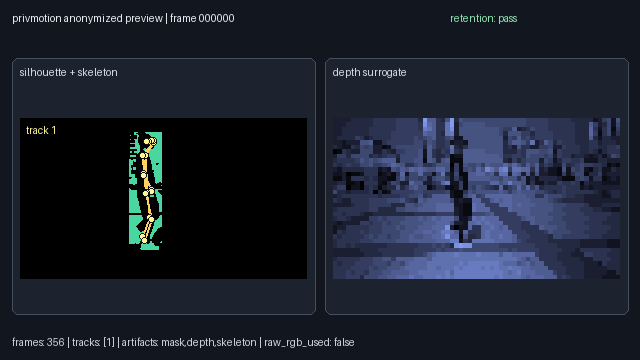

# privmotion

Privacy-preserving motion analytics for videos, RGB-D streams, and frame folders.

> [!NOTE]
> `privmotion` is a runnable research prototype and OpenCV-contrib-style module
> scaffold. It is not an official OpenCV module, and it is not a production
> privacy guarantee.

`privmotion` transforms identity-bearing visual input into anonymized kinematic
artifacts: skeletons, silhouettes, depth-like surrogates, feature records,
benchmark reports, and GIF/MP4 previews. Raw RGB is used only in memory for
processing and is not written to outputs by default.

[](pyproject.toml)
[](LICENSE)
[](#yolo-pose)
[](#opencv-style-scaffold)

## Table of Contents

- [What is privmotion?](#what-is-privmotion)
- [Demo](#demo)
- [Quick Start](#quick-start)
- [Key Capabilities](#key-capabilities)
- [Output Artifacts](#output-artifacts)
- [Encrypted Feature Controls](#encrypted-feature-controls)
- [Privacy and Security Docs](#privacy-and-security-docs)
- [Architecture](#architecture)
- [Dataset Evaluation](#dataset-evaluation)
- [OpenCV-Style Scaffold](#opencv-style-scaffold)
- [Development](#development)
- [Privacy Scope and Limitations](#privacy-scope-and-limitations)
- [License](#license)

## What is privmotion?

`privmotion` is a prototype toolkit for privacy-preserving kinematic analytics.
It accepts image files, MP4 files, and directories of frames, then exports
machine-readable motion data without saving the original RGB frames.

The goal is to make motion analysis inspectable without exposing the source
video by default. A typical run produces skeleton keypoints, silhouette masks,
low-resolution depth-like surrogates, simple kinematic features, validation
reports, and an anonymized preview render.

## Demo

<p align='center'>
  
<p>

Sample privmotion demo.

Generate a local anonymized preview:

```bash
PYTHONPATH=src python -m privmotion.cli.process \
  --input examples/videoplayback.mp4 \
  --output out/demo \
  --mode skeleton,silhouette,depth-surrogate,features

PYTHONPATH=src python -m privmotion.cli.visualize \
  --output out/demo \
  --visualization assets/preview.mp4 \
  --fps 8 \
  --size 1280x720
```

For a GIF preview instead:

```bash
PYTHONPATH=src python -m privmotion.cli.visualize \
  --output out/demo \
  --visualization assets/preview.gif \
  --fps 6 \
  --size 960x540
```

The visualizer reads anonymized outputs only. It does not reload or display the
original raw video.

## Quick Start

### Install

```bash
python -m pip install -e .
```

### YOLO Pose

Install optional YOLO-Pose support:

```bash
python -m pip install -e ".[pose]"
```

With `--pose-backend auto`, `privmotion` tries YOLO-Pose when Ultralytics is
installed and falls back to the deterministic prototype backend when it is not.
YOLO may download model weights such as `yolo11n-pose.pt` on first use. Model
weights are ignored by git.

### Process a Video

```bash
PYTHONPATH=src python -m privmotion.cli.process \
  --input examples/videoplayback.mp4 \
  --output out/video_run \
  --mode skeleton,silhouette,depth-surrogate,features
```

Force YOLO-Pose:

```bash
PYTHONPATH=src python -m privmotion.cli.process \
  --input examples/videoplayback.mp4 \
  --output out/video_yolo \
  --mode skeleton,silhouette,depth-surrogate,features \
  --pose-backend yolo \
  --pose-model yolo11n-pose.pt
```

Force the lightweight prototype backend:

```bash
PYTHONPATH=src python -m privmotion.cli.process \
  --input examples/videoplayback.mp4 \
  --output out/video_prototype \
  --mode skeleton,silhouette,depth-surrogate,features \
  --pose-backend prototype
```

### Validate and Render

```bash
PYTHONPATH=src python -m privmotion.cli.validate \
  --output out/video_run

PYTHONPATH=src python -m privmotion.cli.visualize \
  --output out/video_run \
  --visualization out/video_run/preview.mp4 \
  --fps 8 \
  --size 1280x720
```

### Benchmark

```bash
PYTHONPATH=src python -m privmotion.cli.benchmark \
  --output out/video_run \
  --report out/video_run/benchmark_report.json
```

## Key Capabilities

- **No raw RGB retention by default**: source frames are used in memory and are
  not copied into the output directory.
- **Anonymized motion export**: skeletons, masks, depth surrogates, and feature
  records are saved as machine-readable artifacts.
- **Opt-in encrypted features**: Phase 5 can encrypt kinematic feature records
  with a Fernet key, access policy, and audit log while keeping raw RGB
  unrecoverable by default.
- **YOLO-first pose path**: `auto` uses YOLO-Pose when available and records any
  fallback reason in `metadata.json`.
- **Person-constrained silhouettes**: YOLO person detections can constrain mask
  output so silhouettes are not full-scene foreground by default.
- **Portable previews**: visualizations render to GIF or MP4 from anonymized
  artifacts.
- **Local benchmark harness**: deterministic proxy metrics report utility,
  privacy-retention status, and systems output size.
- **Manifest evaluation**: batch-process local datasets and aggregate per-sample
  metrics without downloading external datasets.
- **OpenCV-style scaffold**: C++ headers, CMake, docs, samples, and source-level
  tests define a future OpenCV-contrib module shape.

## Output Artifacts

A processed run writes a directory like this:

```text
out/video_run/
  metadata.json
  skeletons.json
  features.json
  access_policy.json
  audit_log.jsonl
  retention_report.json
  benchmark_report.json
  preview.mp4
  silhouettes/
  depth_surrogates/
```

Important metadata fields:

| Field | Meaning |
| --- | --- |
| `backends.requested_pose_backend` | Backend requested by the user. |
| `backends.pose` | Backend actually used for pose extraction. |
| `backends.pose_model` | Selected pose model when YOLO is used. |
| `backends.pose_fallback_reason` | Reason `auto` fell back, if it did. |
| `feature_encryption.mode` | `none` by default, or `fernet` for encrypted feature records. |
| `feature_encryption.policy_id` | Access policy ID when encrypted features are enabled. |
| `retention.raw_rgb_written` | Should remain `false` for default runs. |

## Encrypted Feature Controls

Phase 5 adds opt-in encrypted **feature records only**. It does not make raw RGB,
skeletons, silhouettes, depth surrogates, or previews recoverable.

Generate a Fernet key:

```bash
python - <<'PY'
from cryptography.fernet import Fernet
print(Fernet.generate_key().decode("ascii"))
PY
```

Export the key before processing:

```bash
export PRIVMOTION_RECOVERY_KEY="<generated-fernet-key>"
```

Create an access policy JSON, for example:

```json
{
  "policy_id": "demo-policy",
  "allowed_purposes": ["research-review"],
  "requires_audit": true
}
```

Process with encrypted feature records:

```bash
PYTHONPATH=src python -m privmotion.cli.process \
  --input examples/videoplayback.mp4 \
  --output out/video_encrypted \
  --mode skeleton,silhouette,depth-surrogate,features \
  --feature-encryption fernet \
  --access-policy policies/demo-policy.json \
  --audit-actor local-operator \
  --audit-purpose research-review
```

Inspect encrypted recovery-policy metadata without decrypting records:

```bash
PYTHONPATH=src python -m privmotion.cli.recovery_inspect \
  --output out/video_encrypted \
  --audit-actor reviewer \
  --audit-purpose policy-check
```

Encrypted runs write `features.json` with `encrypted_records`,
`access_policy.json`, and `audit_log.jsonl`. There is no decryption CLI in this
phase.

## Privacy and Security Docs

Use these documents when evaluating whether `privmotion` is appropriate for a
dataset, demo, research workflow, or regulated environment:

- [PRIVACY_MODEL.md](PRIVACY_MODEL.md): explains what enters the system, what is
  stored or discarded, what privacy level the tool provides, and what it does
  not guarantee.
- [DATA_RETENTION.md](DATA_RETENTION.md): defines the `no-raw-rgb` retention
  policy, generated artifact lifecycle, deletion guidance, and demo media rules.
- [THREAT_MODEL.md](THREAT_MODEL.md): documents assets, trust boundaries, abuse
  paths, risks, and mitigations for the current CLI/library prototype.

## Architecture

```text
RGB / RGB-D / video input
        |
        v
frame ingest
        |
        v
person detection or segmentation
        |
        v
appearance suppression
        |
        +--> skeleton export
        +--> silhouette export
        +--> depth surrogate export
        +--> feature records
        |
        v
retention validation + benchmark reports + anonymized preview
```

The Python implementation is the runnable path today. The C++ scaffold mirrors
the same concepts for future OpenCV-style integration.

## Dataset Evaluation

Create a local manifest:

```json
{
  "samples": [
    {
      "id": "walk_001",
      "input": "videos/walk_001.mp4",
      "label": "walk",
      "split": "test",
      "expected_frames": 120
    }
  ]
}
```

Run evaluation:

```bash
PYTHONPATH=src python -m privmotion.cli.dataset_eval \
  --manifest datasets/demo_manifest.json \
  --output out/dataset_eval \
  --visualize \
  --visualization-ext .mp4
```

This writes per-sample process, validation, benchmark, and optional preview
outputs, plus:

```text
out/dataset_eval/dataset_report.json
```

The current evaluator uses deterministic local proxy metrics. ORPose-Depth,
Market-1501-style re-identification datasets, and consented custom video remain
future dataset integrations.

## OpenCV-Style Scaffold

The repo includes a Phase 4 scaffold under:

```text
modules/privmotion/
```

It contains:

- `CMakeLists.txt`
- public OpenCV-style headers
- dependency-light C++ stubs
- a C++ sample
- source-level smoke tests
- module documentation

The scaffold defines future API concepts such as
`cv::privmotion::AnonymizationConfig`,
`cv::privmotion::KinematicFrame`, `cv::privmotion::PrivacyReport`,
`cv::privmotion::UtilityReport`, and
`cv::privmotion::PrivMotionPipeline`.

## Development

Run the test suite:

```bash
python -m pytest
```

Useful CLI help commands:

```bash
PYTHONPATH=src python -m privmotion.cli.process --help
PYTHONPATH=src python -m privmotion.cli.validate --help
PYTHONPATH=src python -m privmotion.cli.visualize --help
PYTHONPATH=src python -m privmotion.cli.benchmark --help
PYTHONPATH=src python -m privmotion.cli.dataset_eval --help
PYTHONPATH=src python -m privmotion.cli.recovery_inspect --help
```

Local generated files are ignored through `.gitignore`, including `out/`,
`outputs/`, virtual environments, install metadata, YOLO weights, and the longer
local planning reference `README.local.md`.

## Privacy Scope and Limitations

> [!WARNING]
> Anonymized motion artifacts can still leak identity through gait, body shape,
> silhouette geometry, rare motion patterns, or downstream model behavior.

Current limitations:

- This is a prototype, not a production privacy guarantee.
- YOLO-Pose improves skeleton placement but can still miss people or misplace
  keypoints.
- The prototype backend is deterministic and useful for testing, but it is not a
  real pose model.
- Benchmarks are local deterministic proxies, not full face recognition,
  person re-identification, gait leakage, or reconstruction-risk evaluations.
- Phase 5 encrypts feature records only; it does not recover raw RGB or decrypt
  records from the CLI.
- Raw RGB is not saved by default, but users still need consent-oriented data
  policies when processing real people.

## License

Apache License 2.0. See [`LICENSE`](LICENSE).

## Contributing

Contributions are welcome!

See [`CONTRIBUTING.md`](CONTRIBUTING.md).
