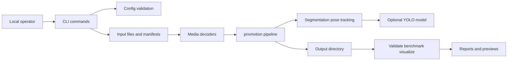

# Threat Model

This threat model covers the current `privmotion` repository as a local Python
CLI/library prototype plus an OpenCV-contrib-style scaffold. It is based on the
current repo structure and should be revisited if the tool becomes a hosted
service, accepts remote uploads, or expands reversible/encrypted access
controls beyond feature records.

## Executive Summary

The highest-risk themes are local processing of untrusted media, optional YOLO
model loading, residual identity leakage from derived motion artifacts, and
operator-selected output paths. `privmotion` is not a network service today, so
remote pre-auth attack paths are out of scope unless another application wraps
these CLIs. The main security objective is to prevent raw RGB retention by
default while reducing the risk that generated artifacts, reports, previews, or
metadata leak identity or local filesystem context.

The `hipaa-expert-aggregate` profile reduces person-level output risk by
writing aggregate-only reports for Expert Determination review. It is not a
legal certification path by itself, and the OpenCV-style C++ scaffold remains
conceptual rather than the HIPAA-oriented runtime.

## Scope and Assumptions

In scope:

- Python runtime package under `src/privmotion/`.
- CLI entry points declared in `pyproject.toml`.
- Processing, validation, benchmarking, visualization, and dataset-evaluation
  flows.
- Generated JSON, PGM, GIF, and MP4 artifacts.
- Optional YOLO-Pose backend behavior.
- Documentation-level privacy and OpenCV scaffold assumptions.
- HIPAA Expert Determination support behavior in the Python CLI/library path.

Out of scope:

- A hosted web API, remote upload service, or multi-tenant deployment.
- Full OpenCV C++ module compilation or generated Python bindings.
- External dataset hosting and external identity-scoring model integrations.
- Legal compliance review.
- Automatic HIPAA de-identification certification.

Assumptions:

- The default deployment model is a local CLI used by a trusted operator.
- Input media and dataset manifests may be untrusted if downloaded from public
  sources.
- The process runs with the local user's filesystem privileges.
- Output artifacts may be shared or committed accidentally unless ignored or
  reviewed.
- Optional YOLO weights and model paths are operator-selected but may be
  downloaded from the network by Ultralytics.

Open questions that would change risk ranking:

- Will `privmotion` be wrapped by a web service or notebook shared with
  untrusted users?
- Will outputs be stored in shared cloud buckets or published as demo assets?
- Will future reversible access controls store encrypted raw data, decrypt
  feature records, or recover broader identity-bearing data?

Evidence anchors:

- CLI scripts: `pyproject.toml` / `[project.scripts]`.
- Privacy policy: `PRIVACY_MODEL.md` / `retention = no-raw-rgb`.
- Runtime pipeline: `src/privmotion/pipeline.py` / `PrivMotionPipeline.run`.

## System Model

### Primary Components

- CLI commands:
  - `privmotion-process`: reads media or frame directories and writes motion
    artifacts.
  - `privmotion-validate`: scans output directories for raw-RGB retention
    violations and HIPAA aggregate-profile artifact violations.
  - `privmotion-benchmark`: computes deterministic utility/privacy proxy
    metrics.
  - `privmotion-visualize`: renders GIF/MP4 previews from anonymized outputs.
  - `privmotion-dataset-eval`: processes local manifest samples and aggregates
    reports.
- Configuration:
  - `ProcessConfig` validates output modes, retention policy, pose backend, and
    frame limits. It also restricts `hipaa-expert-aggregate` to aggregate-only
    output mode.
- Input and decoding:
  - `load_frames`, `load_video_frames`, `read_image`, and
    `read_portable_anymap` read local images, videos, and frame directories.
- Backends:
  - `PrototypeSegmenter`, `GeometryPoseEstimator`, `SingleTrackAssigner`, and
    optional `YoloPoseEstimator`.
- Export and retention:
  - `write_json`, `write_pgm`, `validate_output_dir`, and metadata/report
    writers.
- Visualization and reporting:
  - `visualize_output_dir`, `benchmark_output_dir`, and
    `evaluate_dataset_manifest`.

### Data Flows and Trust Boundaries

- Operator -> CLI arguments:
  - Data types: paths, modes, backend names, model path, frame limits, preview
    size.
  - Channel: local process arguments.
  - Controls: argparse required arguments and choices for some flags; config
    validation for modes, retention policy, pose backend, and positive
    `max_frames`.
  - Evidence: `src/privmotion/cli/process.py` / `build_parser`;
    `src/privmotion/config.py` / `ProcessConfig.__post_init__`.

- Local files -> media decoders:
  - Data types: RGB images, PGM/PPM, MP4/video files, frame directories.
  - Channel: local filesystem reads through OpenCV, imageio/ffmpeg, or custom
    PNM parsing.
  - Controls: extension allow-list and skipped unreadable frames; no sandboxing
    or streaming isolation.
  - Evidence: `src/privmotion/io.py` / `IMAGE_EXTENSIONS`,
    `VIDEO_EXTENSIONS`, `load_frames`.

- Decoded frames -> pipeline and backends:
  - Data types: in-memory NumPy arrays, masks, keypoints, bounding boxes,
    centroids.
  - Channel: in-process Python objects.
  - Controls: default `no-raw-rgb` metadata; raw frames are not exported by the
    pipeline.
  - Evidence: `src/privmotion/pipeline.py` / `PrivMotionPipeline.run`;
    `src/privmotion/pipeline.py` / `"raw_rgb_written": False`.

- Pipeline -> optional YOLO model:
  - Data types: raw frames in memory, model path/name, inference results.
  - Channel: in-process Ultralytics API call.
  - Controls: optional dependency; `--pose-backend yolo` fails clearly when
    unavailable; `auto` falls back to prototype.
  - Evidence: `src/privmotion/backends.py` / `YoloPoseEstimator.__init__`,
    `create_pose_estimator`.

- Pipeline -> output directory:
  - Data types: JSON metadata, skeletons, features, retention reports, masks,
    depth surrogates.
  - Channel: local filesystem writes.
  - Controls: mode allow-list; JSON/PGM exporters create parent directories;
    no path sandbox or symlink hardening.
  - Evidence: `src/privmotion/config.py` / `VALID_OUTPUT_MODES`;
    `src/privmotion/exporters.py` / `write_json`, `write_pgm`.

- Output directory -> validation/benchmark/visualization:
  - Data types: generated JSON, PGM masks, PGM depth surrogates, GIF/MP4/PNG
    previews.
  - Channel: local filesystem reads and writes.
  - Controls: requires `metadata.json` for benchmark and visualization;
    retention validation scans for likely raw-RGB file names.
  - Evidence: `src/privmotion/validation.py` / `validate_output_dir`;
    `src/privmotion/benchmark.py` / `benchmark_output_dir`;
    `src/privmotion/visualization.py` / `visualize_output_dir`.

#### Diagram

## Assets and Security Objectives

| Asset | Why it matters | Security objective (C/I/A) |
| --- | --- | --- |
| Raw RGB input frames | Directly identify people, locations, and context. | C |
| Skeletons and features | Can leak gait, body proportions, and motion identity; encrypted features reduce casual exposure only when enabled. | C/I |
| Silhouettes and depth surrogates | Can leak body shape, posture, and carried objects. | C |
| Metadata and reports | Can leak local paths, sample IDs, labels, backend choices, and dataset composition. | C/I |
| Output directories | Hold privacy-sensitive derived data and previews. | C/I |
| YOLO model weights | May execute unsafe deserialization paths or alter output integrity if untrusted. | I/C |
| Local filesystem | The CLI can read inputs and write outputs with user privileges. | C/I/A |
| Compute resources | Large videos or manifests can exhaust memory, CPU, disk, or GPU. | A |

## Attacker Model

### Capabilities

- Can provide a malicious or oversized image/video/frame directory to a local
  operator.
- Can provide a malicious dataset manifest with many samples or sensitive local
  paths.
- Can influence output paths if the operator runs supplied commands.
- Can provide or suggest an untrusted YOLO model path or weight file.
- Can inspect shared artifacts if outputs are published or committed.

### Non-Capabilities

- No direct network access to `privmotion` exists in this repo.
- No authentication, sessions, or cross-tenant authorization boundaries exist
  because this is not a web service.
- The attacker cannot execute commands unless the operator runs the CLI or a
  wrapper service invokes it.
- The attacker cannot read arbitrary local files unless a manifest, input path,
  output path, or wrapper service exposes that behavior.

## Entry Points and Attack Surfaces

| Surface | How reached | Trust boundary | Notes | Evidence |
| --- | --- | --- | --- | --- |
| Process CLI | `privmotion-process --input --output --mode` | Operator args to local process | Main path for raw media handling and artifact export. | `src/privmotion/cli/process.py` / `build_parser` |
| Dataset eval CLI | `privmotion-dataset-eval --manifest --output` | Manifest JSON to local batch processor | Manifest paths drive repeated processing and output creation. | `src/privmotion/dataset_eval.py` / `_load_manifest`, `_resolve_input_path` |
| Visualization CLI | `privmotion-visualize --output --visualization` | Output artifacts to GIF/MP4 writer | Reads generated JSON/PGM and writes previews. | `src/privmotion/visualization.py` / `visualize_output_dir` |
| Benchmark CLI | `privmotion-benchmark --output --report` | Output artifacts to report writer | Reads JSON/PGM and recursively counts files/bytes. | `src/privmotion/benchmark.py` / `benchmark_output_dir` |
| Validation CLI | `privmotion-validate --output` | Output directory to retention scanner | Heuristic raw-RGB retention checks. | `src/privmotion/validation.py` / `validate_output_dir` |
| Media decoders | Image/video input paths | Untrusted files to OpenCV/imageio/PNM parser | Decoder bugs and oversized files can affect local process. | `src/privmotion/io.py` / `load_frames`, `read_portable_anymap` |
| YOLO model path | `--pose-backend yolo --pose-model` | Model file/name to Ultralytics loader | Untrusted model weights are high-risk. | `src/privmotion/backends.py` / `YoloPoseEstimator.__init__` |
| Output paths | CLI `--output`, report, visualization, frames dir | Operator path to filesystem writes | Can overwrite or create files in arbitrary writable locations. | `src/privmotion/exporters.py` / `write_json`, `write_pgm` |

## Top Abuse Paths

1. Attacker goal: deny service with oversized media.
   1. Attacker provides a very large video or frame directory.
   2. Operator runs `privmotion-process` or dataset eval.
   3. `load_frames` accumulates frames in memory before processing.
   4. The local process exhausts memory, CPU, disk, or GPU resources.

2. Attacker goal: execute or influence code through an untrusted model file.
   1. Attacker convinces the operator to use `--pose-backend yolo`.
   2. Attacker supplies or suggests an untrusted `--pose-model` path.
   3. Ultralytics loads the model file.
   4. Local execution integrity is compromised or outputs are manipulated.

3. Attacker goal: leak identity through generated artifacts.
   1. Operator processes sensitive source video.
   2. Raw RGB is not stored, but skeletons, silhouettes, depth surrogates,
      metadata, or previews are generated.
   3. Outputs are shared or committed.
   4. A viewer or downstream model re-identifies a person through gait, body
      shape, motion, or labels.

4. Attacker goal: bypass retention expectations through misleading output.
   1. A wrapper or future change writes raw frames under names not caught by
      the heuristic validator.
   2. `privmotion-validate` passes because names do not match raw-RGB patterns.
   3. Raw or near-raw identity-bearing data is shared.

5. Attacker goal: write files in unsafe locations.
   1. Attacker supplies command examples with sensitive output/report paths.
   2. Operator runs the command with elevated or broad filesystem privileges.
   3. Exporters write JSON, PGM, GIF, MP4, or PNG files to arbitrary writable
      locations.
   4. Existing files are overwritten or sensitive directories are polluted.

6. Attacker goal: cause batch-scale privacy exposure.
   1. Attacker provides a dataset manifest containing many local inputs or
      identifying labels.
   2. Dataset evaluation processes all samples and records paths, labels, and
      metrics.
   3. Aggregated outputs and previews are published or committed.
   4. Dataset composition and participant identity are exposed.

7. Attacker goal: trigger decoder vulnerabilities.
   1. Attacker provides malformed media.
   2. OpenCV, imageio/ffmpeg, Pillow, or custom PNM parsing handles it.
   3. A dependency vulnerability or parser edge case crashes the process or
      compromises local execution.

## Threat Model Table

| Threat ID | Threat source | Prerequisites | Threat action | Impact | Impacted assets | Existing controls (evidence) | Gaps | Recommended mitigations | Detection ideas | Likelihood | Impact severity | Priority |
| --- | --- | --- | --- | --- | --- | --- | --- | --- | --- | --- | --- | --- |
| TM-001 | Malicious media provider | Operator processes untrusted or oversized media. | Provide huge or malformed image/video/frame input that is decoded and held in memory. | Resource exhaustion or decoder-triggered crash; possible dependency-level exploit. | Compute resources, local process, raw frames. | Extension allow-list and skipped unreadable frames in `src/privmotion/io.py`; optional `max_frames` in `ProcessConfig`. | Frames are loaded into a list before processing; dataset eval does not expose `max_frames`; no file size, pixel count, duration, or timeout limits. | Stream frames incrementally; add max bytes, max pixels, max duration, and dataset max-sample limits; expose `--max-frames` in dataset eval; document processing untrusted media in a sandbox. | Log input summary, skipped frames, decode errors, frame count, byte size, processing time, and memory warnings. | medium | high | high |
| TM-002 | Untrusted model source | Operator enables YOLO or auto downloads/loads model weights. | Supply malicious or compromised model file/name. | Local code execution risk through unsafe model loading or integrity compromise of pose outputs. | Local filesystem, model weights, output integrity. | YOLO is optional and explicit install is documented; `yolo` fails if dependency missing in `src/privmotion/backends.py`. | No allow-list, hash pinning, model provenance check, or warning when model path is local/untrusted. | Add trusted model allow-list and hash verification; warn for local model paths; document only using trusted weights; consider disabling YOLO auto-download in high-assurance mode. | Record model path/hash/source in metadata; alert when unknown model paths are used. | medium | high | high |
| TM-003 | Output recipient or downstream analyst | Outputs are shared publicly or with broad access. | Re-identify subjects from skeletons, silhouettes, depth surrogates, plaintext features, previews, or metadata. | Privacy harm despite no raw RGB retention. | Skeletons, features, masks, previews, metadata. | README and `PRIVACY_MODEL.md` warn that derived artifacts can leak identity; raw RGB not written in `pipeline.py`; Phase 5 can encrypt feature records only; `hipaa-expert-aggregate` writes aggregate-only reports and blocks visualization/benchmark reports. | No formal privacy metric, differential privacy, complete access control, decrypted recovery workflow, or automatic legal certification. | Use `hipaa-expert-aggregate` for Expert Determination support; add artifact sensitivity labels for standard outputs; require explicit acknowledgement before writing previews to `assets/`; keep encrypted features enabled for sensitive feature exports. | Review `retention_report.json`; inspect encrypted-feature policy with `privmotion-recovery-inspect`; scan outputs for paths/labels; verify HIPAA aggregate validation passes before expert review. | high | high | high |
| TM-004 | Wrapper service or future code change | A wrapper writes raw frames or near-raw frames into output directories. | Store raw RGB with names not caught by validator. | False sense of privacy compliance and raw identity leakage. | Raw RGB frames, output directory, validation reports. | `validate_output_dir` scans raw-like names and disallows raw images outside allowed dirs. | Heuristic name-based validation can miss raw data; allowed image dirs are trusted by name. | Add content-based checks for RGB images; enforce writer registry; keep output schema allow-list; add tests that fail on raw-looking data in unexpected paths. | Include validator version and scanned file counts; add CI tests for retention bypass cases. | medium | high | high |
| TM-005 | Malicious manifest author | Operator runs dataset eval on attacker-controlled manifest. | Reference many files, sensitive paths, or identifying labels; trigger batch output creation. | DoS, metadata leakage, accidental processing of non-consented data. | Local paths, dataset metadata, generated outputs, compute resources. | Manifest must be JSON object/list; sample ID is sanitized in `dataset_eval.py`. | Input path is resolved relative to manifest and not restricted to a dataset root; no sample count or total frame limits. | Add `--dataset-root` and reject paths outside it; add max samples and max frames; redact absolute paths from reports by default. | Log resolved path roots, sample counts, rejected paths, and per-sample frame counts. | medium | medium | medium |
| TM-006 | Local user or misleading instructions | Operator chooses unsafe output/report/preview paths. | Write generated files into sensitive or unintended directories. | File overwrite, data exposure, repository pollution, or confusion. | Output files, local filesystem, repo hygiene. | Exporters create parent dirs and write explicit paths; `.gitignore` ignores common generated dirs and weights. | No output root sandbox, symlink handling, overwrite confirmation, or same-path checks. | Refuse output inside source input directories by default; add `--force` for overwrites; warn for paths outside repo or under `assets/`; protect against symlinked outputs if needed. | Emit output path, file count, and overwrite warnings in metadata and CLI logs. | medium | medium | medium |
| TM-007 | Malformed output artifact provider | Operator benchmarks or visualizes output dirs from untrusted sources. | Provide malformed JSON/PGM or huge output tree to benchmark/visualization commands. | Crash or resource exhaustion; misleading report output. | Reports, previews, local compute. | Benchmark and visualization require `metadata.json`; unsupported visualization suffixes are rejected. | JSON and PGM readers do not enforce size limits; benchmark recursively scans all files. | Add max output tree size, max PGM dimensions, schema validation, and safer parse errors. | Record artifact counts, total bytes, parse failures, and schema validation failures. | low | medium | low |

## Criticality Calibration

- Critical:
  - A hosted wrapper allows remote users to process uploaded media and reach
    local files or execute model code.
  - A default path stores raw RGB frames despite `no-raw-rgb`.
  - Raw RGB recovery or decrypted record export is added without access policy
    and audit logging.

- High:
  - Untrusted YOLO weights are loaded without provenance controls.
  - Public demo assets reveal identifiable gait, body shape, or labels.
  - Oversized media can reliably exhaust a shared processing machine.

- Medium:
  - Dataset manifests can process unintended local files or leak absolute paths.
  - Output paths can overwrite local files when a user follows unsafe commands.
  - Retention validation misses raw-looking artifacts due to heuristic naming.

- Low:
  - A malformed generated artifact crashes only a local benchmark run.
  - CLI error output reveals a local path to the operator.
  - A prototype pose failure reduces analytic utility without changing privacy
    exposure.

## Focus Paths for Security Review

| Path | Why it matters | Related Threat IDs |
| --- | --- | --- |
| `src/privmotion/io.py` | Handles untrusted media decoding, frame loading, and custom PNM parsing. | TM-001, TM-007 |
| `src/privmotion/backends.py` | Loads optional YOLO models and converts model outputs into stored pose records. | TM-002, TM-003 |
| `src/privmotion/pipeline.py` | Central flow for raw frame handling, artifact generation, metadata, and retention flags. | TM-003, TM-004 |
| `src/privmotion/exporters.py` | Writes JSON and PGM artifacts to operator-selected paths. | TM-004, TM-006 |
| `src/privmotion/validation.py` | Implements heuristic raw-RGB retention validation. | TM-004 |
| `src/privmotion/dataset_eval.py` | Resolves manifest paths, runs batch processing, and writes aggregate reports. | TM-001, TM-005 |
| `src/privmotion/visualization.py` | Reads generated artifacts and writes GIF/MP4/PNG preview outputs. | TM-003, TM-006, TM-007 |
| `src/privmotion/benchmark.py` | Reads generated artifacts recursively and produces privacy/utility proxy reports. | TM-003, TM-007 |
| `src/privmotion/cli/*.py` | Defines user-controlled arguments and error handling for all public commands. | TM-001, TM-005, TM-006 |
| `pyproject.toml` | Declares runtime dependencies, optional YOLO extra, and console entry points. | TM-002 |
| `PRIVACY_MODEL.md` | Sets expectations for privacy guarantees and non-guarantees. | TM-003, TM-004 |
| `.gitignore` | Keeps outputs, local metadata, and model weights out of normal git tracking. | TM-003, TM-006 |

## Existing Controls Summary

- `ProcessConfig` accepts only known output modes and only the `no-raw-rgb`
  retention policy.
- CLI parsers require explicit input and output paths.
- The pipeline records `raw_rgb_written: False` and writes a
  `retention_report.json`.
- Validation scans for raw-like filenames outside allowed mask/depth output
  directories.
- YOLO support is optional and fails clearly if the dependency is missing.
- Dataset sample IDs are sanitized before being used as output directory names.
- `.gitignore` excludes generated outputs, install metadata, virtual
  environments, local README planning notes, and `*.pt` model weights.

## Recommended Near-Term Work

1. Add processing limits:
   - Maximum input bytes, frame count, pixel count, and dataset sample count.
   - Streaming frame processing instead of retaining all decoded frames.

2. Harden YOLO model loading:
   - Warn when `--pose-model` is a local path.
   - Record model hash and source in metadata.
   - Offer a trusted-model allow-list or a no-download mode.

3. Strengthen retention validation:
   - Add content-based checks for unexpected RGB images.
   - Keep an explicit output schema allow-list.
   - Add tests for near-raw preview or image leakage cases.

4. Reduce metadata leakage:
   - Use `hipaa-expert-aggregate` when reports are intended for HIPAA Expert
     Determination review.
   - Keep redaction as the default for HIPAA aggregate dataset reports.

5. Add safe output handling:
   - Warn on overwrites.
   - Reject output directories equal to or inside input directories unless
     explicitly forced.
   - Consider symlink checks for high-assurance use.

## Quality Check

- Covered discovered entry points: process, validate, benchmark, visualize,
  dataset eval, media decoders, YOLO model path, output paths.
- Covered each trust boundary at least once in the threat table.
- Separated runtime CLI behavior from C++ scaffold and future hosted service
  assumptions.
- Explicitly marked local-operator and non-network assumptions.
- Listed open questions that would materially change risk ranking.
